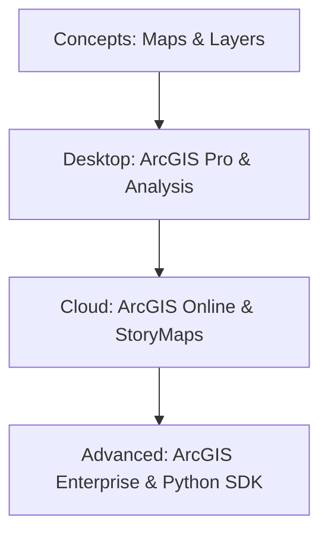

# 🏆 ArcGIS Mastery
A structured path to mastering Esri's ArcGIS ecosystem (ArcGIS Pro, Online, and Enterprise).

---

## 🛤️ Roadmap Flow

---

## 🛠️ Mandatory Prerequisites
*   **Logical Reasoning**: Basic spatial thinking.
*   **Operating System**: Proficiency with Windows (ArcGIS Pro requirement).

---

## 🏛️ Level 1: Foundations
_Coming soon: Understanding the Esri ecosystem._

## 💻 Level 2: ArcGIS Pro Mastery
_Coming soon: Editing, Geodatabases, and Toolbox workflows._

## ☁️ Level 3: Web GIS
_Coming soon: ArcGIS Online, Dashboards, and Field Maps._

---
_Happy Mapping with Pro Tools! 🏆🌍_
