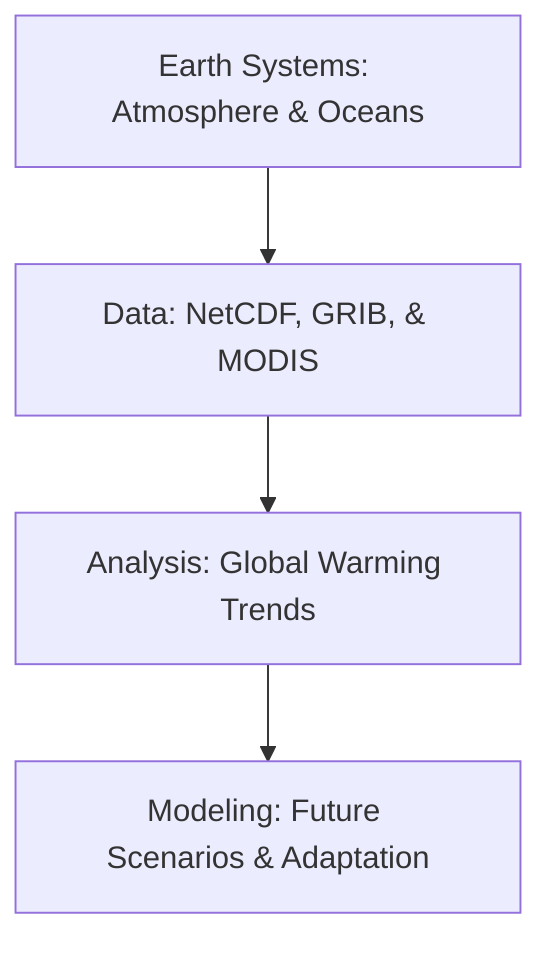

# 🌍 Climate Science Resources
Using GIS for climate modeling, environmental monitoring, and sustainability analysis.

---

## 🛤️ Roadmap Flow

---

## 🏛️ Level 1: Earth System Foundations
_Resources for understanding climate dynamics coming soon._

## 📊 Level 2: Scientific Data Formats
_Handling NetCDF, HDF5, and GRIB spatial data coming soon._

## 🌡️ Level 3: Climate Change Analysis
_Tutorials on temperature trends and carbon monitoring coming soon._

---
_Map for a sustainable future! 🌿_
