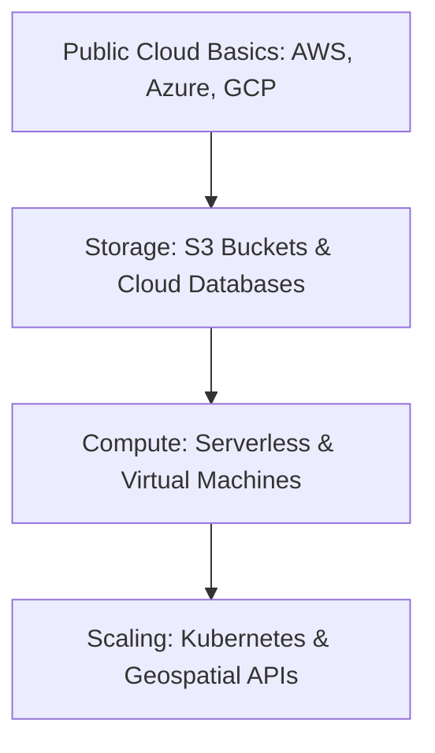

# ☁️ Cloud Geospatial Tools
Harnessing cloud computing for large-scale spatial processing and storage.

---

## 🛤️ Roadmap Flow

---

## 🛠️ Mandatory Prerequisites
*   **Data Engineering**: Understanding of [Spatial Pipelines](./Geospatial-Data-Engineering.md).
*   **Infrastructure**: Basic understanding of HTTP protocols and APIs.
*   **Scripting**: Proficiency in [Python](./Python.md).

---

## 🏛️ Level 1: Cloud Provider Fundamentals
_Introduction to AWS, GCP, and Azure for GIS coming soon._

## 🗄️ Level 2: Scalable Storage
_Resources for S3, Blob Storage, and BigQuery Spatial coming soon._

## 🚀 Level 3: Geospatial Web Services
_Tutorials on OGC APIs and serverless mapping coming soon._

---
_Scale your maps to the sky! ☁️🌍_
