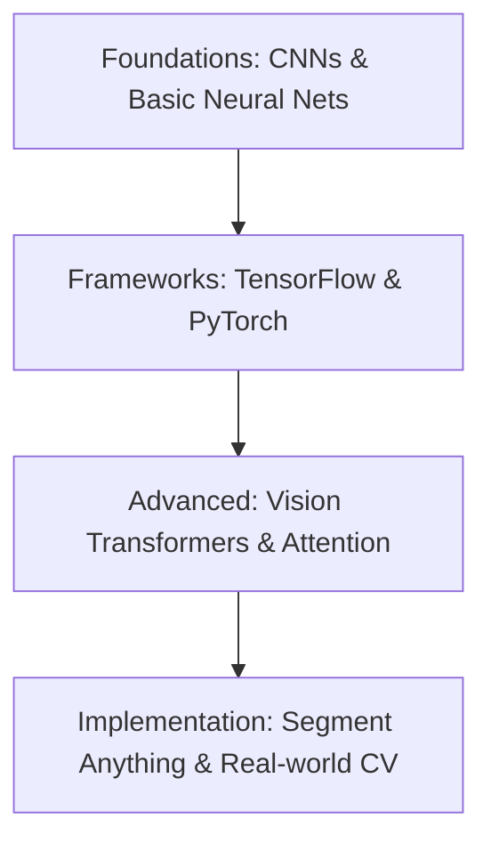

# 🧠 Deep Learning for Remote Sensing
Resources for applying Deep Learning (CNNs, Transformers, etc.) to satellite imagery and spatial data.

---

## 🛤️ Roadmap Flow

---

## 🏛️ Foundations: CNNs & Basic Neural Nets
- [**Deep Learning with CNNs (Playlist)**](https://www.youtube.com/playlist?list=PLTl9hO2Oobd9U0XHz62Lw6EgIMkQpfz74) - Comprehensive series on CNN architectures.

## 🛠️ Frameworks: TensorFlow & PyTorch
- [**Deep learning with Tensorflow, Keras and python**](https://www.youtube.com/watch?v=Mubj_fqiAv8&list=PLeo1K3hjS3uu7CxAacxVndI4bE_o3BDtO) - Comprehensive tutorial series.

## 👁️ Advanced: Vision Transformers (ViT)
- [**Vision Transformers - Explained!**](https://www.youtube.com/watch?v=Hnsrm1ezI3g) - Conceptual overview.
- [**Vision Transformer in PyTorch**](https://www.youtube.com/watch?v=ovB0ddFtzzA&t=784s) - Implementation tutorial.

## 🚀 Implementation: Specialized Models
- [**Segment Anything Model (SAM) for Geospatial**](https://samgeo.sam-methods.info/) - Meta's SAM applied to satellite imagery.

---
_Happy Mapping! 🌍✨_