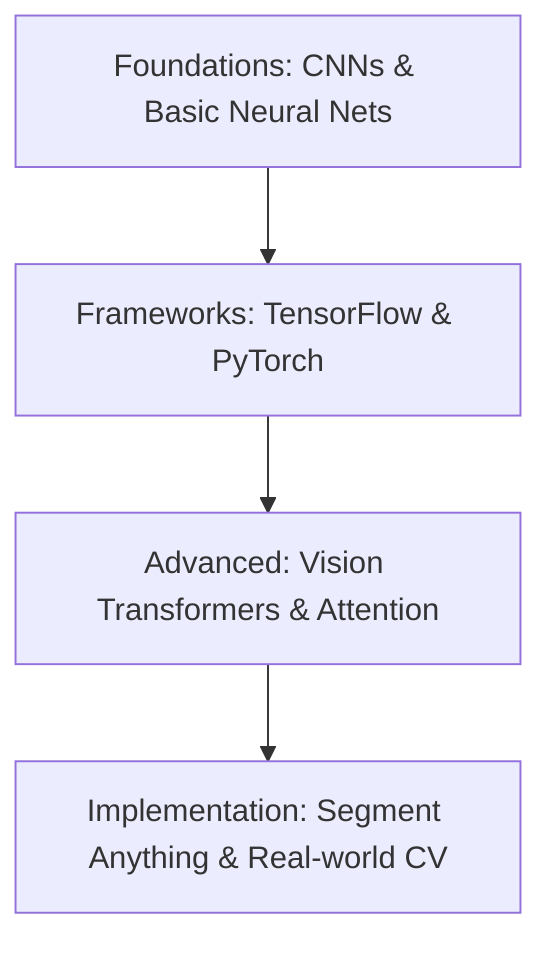

# 🧠 Deep Learning for Remote Sensing
Resources for applying Deep Learning (CNNs, Transformers, etc.) to satellite imagery and spatial data.

---

## 🛤️ Roadmap Flow

---

## 🛠️ Mandatory Prerequisites
*   **Programming**: [Python Basics](./Python.md) (NumPy, Pandas).
*   **Machine Learning**: Understanding of [ML Fundamentals](./Machine-Learning.md).
*   **Math**: Linear Algebra and Calculus basics.

---

## ➗ Mathematics for Deep Learning
Deep Learning is built on math. Understanding these concepts will make you a much stronger practitioner.

- [**Backpropagation by Hand | The Math You Should Know**](https://www.youtube.com/watch?v=12-HUfbyGso) - A step-by-step hand-calculation of how gradients flow through a neural network. Essential for understanding *why* models learn.
- [**Mathematical Engineering of Deep Learning**](https://deeplearningmath.org/) - A comprehensive resource covering the mathematical theory behind Deep Learning algorithms and architectures.

> 💡 **Key Math Topics to Know:**
> - **Linear Algebra**: Matrices, dot products, and transformations.
> - **Calculus**: Derivatives and the chain rule (the backbone of backprop).
> - **Probability**: Distributions, loss functions, and regularization.

---

## 🏛️ Foundations: CNNs & Basic Neural Nets
- [**Neural Networks (Playlist - 3Blue1Brown)**](https://www.youtube.com/playlist?list=PLZHQObOWTQDNU6R1_67000Dx_ZCJB-3pi) - Beautifully animated visual guide to how Neural Networks work from scratch.
- [**Deep Learning with CNNs (Playlist)**](https://www.youtube.com/playlist?list=PLTl9hO2Oobd9U0XHz62Lw6EgIMkQpfz74) - Comprehensive series on CNN architectures.

## 🛠️ Frameworks: TensorFlow & PyTorch
- [**Deep Learning with TensorFlow, Keras, and Python**](https://www.youtube.com/watch?v=Mubj_fqiAv8&list=PLeo1K3hjS3uu7CxAacxVndI4bE_o3BDtO) - A comprehensive guide to building neural networks.
- [**Deep Learning with PyTorch Full Course | Master PyTorch, Tensors, and Neural Networks**](https://www.youtube.com/watch?v=IFsVsXAqPto&list=PPSV) - A full masterclass on Deep Learning and Tensors with PyTorch.

## 👁️ Advanced: Vision Transformers (ViT)
- [**Vision Transformers - Explained!**](https://www.youtube.com/watch?v=Hnsrm1ezI3g) - Conceptual overview.
- [**Vision Transformer in PyTorch**](https://www.youtube.com/watch?v=ovB0ddFtzzA&t=784s) - Implementation tutorial.
- [**Transformers Short Course: Transformer for Meteorological Forecasting Based on Multi-dimensional In (2022-11-30 16:03 GMT-6)**](https://drive.google.com/file/d/1Tr-uk4bnkFoH2obsjKoiJq2RedEQ-m6L/view)

## 🚀 Implementation: Specialized Models
- [**Segment Anything Model (SAM) for Geospatial**](https://github.com/opengeos/segment-geospatial) - Meta's SAM applied to satellite imagery.

## 🌐 Comprehensive Platforms & Organizations
- [**Spatial Ecology**](https://spatial-ecology.net/) - A comprehensive codebase and platform full of material on GeoML computations, GeoFM (Geospatial Foundation Models), remote sensing, and deep learning.

---
_Happy Mapping! 🌍✨_