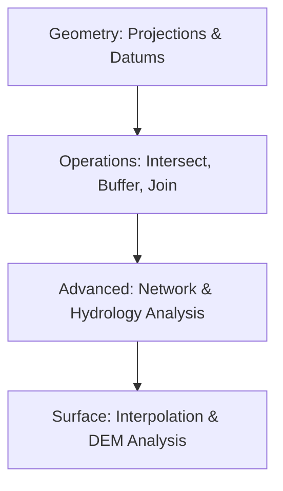

# 🗺️ Geospatial Analysis
Core concepts and methodologies for spatial reasoning and analysis.

---

## 🛤️ Roadmap Flow

---

## 🏛️ Level 1: Geometric Foundations
_Coordinate Reference Systems (CRS) and Projections coming soon._

## 🛠️ Level 2: Vector & Raster Operations
_Resources for basic spatial joins and map algebra coming soon._

## 📍 Level 3: Network & Path Analysis
_Tutorials on routing and connectivity coming soon._

---
_Think spatially! 🌍_
