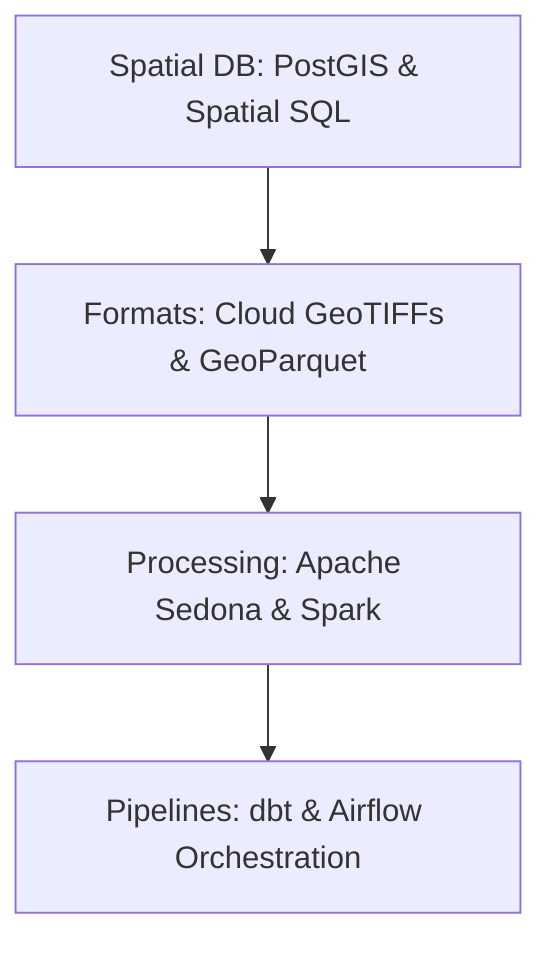

# ⚙️ Geospatial Data Engineering
Building scalable, automated, and cloud-native pipelines for spatial data.

---

## 🛤️ Roadmap Flow

---

## 🏛️ Level 1: Spatial Databases
_Resources for PostGIS and SQL coming soon._

## ☁️ Level 2: Cloud Native Formats
_Documentation on COGs and Zarr coming soon._

## � Level 3: Big Data Pipelines
_Tutorials on Sedona, DuckDB-Spatial, and Spark comin

---
_Build robust mapping systems! 🚀_
