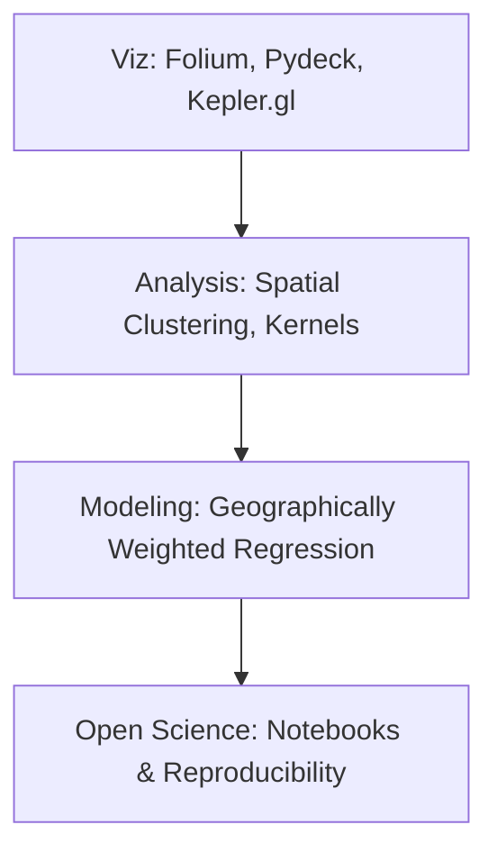

# 🧪 Geospatial Data Science
Integrating data science workflows with geographic information.

---

## 🛤️ Roadmap Flow

---

## 🛠️ Mandatory Prerequisites
*   **Programming**: Intermediate [Python](./Python.md) (Pandas, NumPy).
*   **Statistics**: Spatial autocorrelation and hypothesis testing basics.
*   **Data Viz**: Basic understanding of map projections.

---

## 🎨 Level 1: Geospatial Visualization
_Interactive mapping tutorials coming soon._

## 📊 Level 2: Exploratory Spatial Data Analysis (ESDA)
_Resources for spatial autocorrelation and clustering coming soon._

## 📈 Level 3: Spatial Modeling
_GWR and spatial econometrics resources coming soon._

---
_Extract insights from space! 🌍✨_
