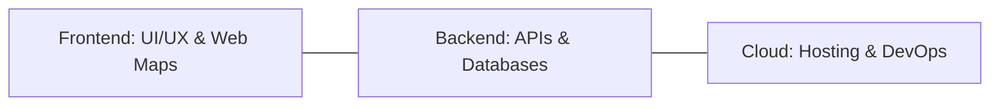

# 💻 Geospatial Full Stack Developer
Master the art of building spatial applications from database to dashboard.

---

## 🛤️ Roadmap Flow

---

## 🛠️ Mandatory Prerequisites
*   **Web Basics**: [HTML, CSS, and JS](https://www.w3schools.com/).
*   **Scripting**: [Python Fundamentals](./Python.md).
*   **Database**: [SQL Fundamentals](https://www.w3schools.com/sql/).

---

## 🎨 Frontend Development
*Focus on mapping libraries and user interface.*
- **Leaflet & Mapbox**: Basic to advanced web mapping.
- **React/Vue Integration**: State management with spatial data.
- **Visualization APIs**: Deck.gl, Kepler.gl, and CesiumJS.

## 🗄️ Backend Development
*Focus on data processing and service architecture.*
- **Spatial APIs**: Building services with FastAPI or Flask.
- **Spatial DBMS**: [PostGIS Mastery](./Geospatial-Data-Engineering.md).
- **Libraries**: GDAL, Fiona, and Shapely (backend processing).

---
_Build the future of mapping! 🚀_
