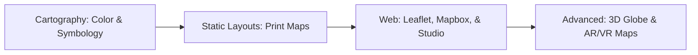

# 🎨 Geovisualization
Modern cartography, interactive mapping, and spatial dashboarding.

---

## 🛤️ Roadmap Flow

---

## 🎨 Level 1: Cartographic Principles
_Resources for color theory and Map Design coming soon._

## 💻 Level 2: Web Mapping Frameworks
_Tutorials for Leaflet.js, OpenLayers, and Mapbox coming soon._

## 📊 Level 3: Dynamic Dashboards
_Building interactive spatial apps (Streamlit, Tableau) coming soon._

---
_Design beautiful maps! ✨_
