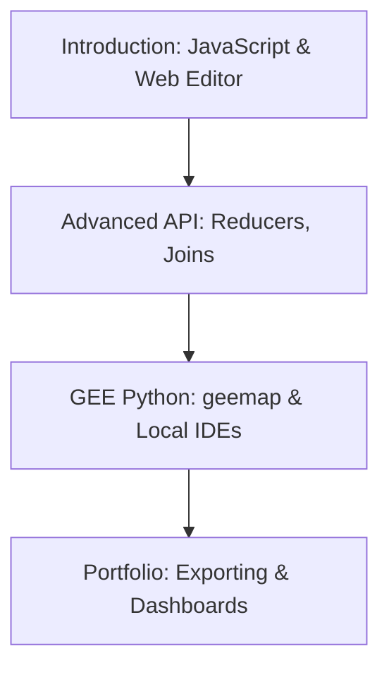

# 🛰️ Google Earth Engine (GEE)
Planetary-scale platform for Earth science data and analysis.

---

## 🛤️ Roadmap Flow

---

## 🏛️ Level 1: JavaScript API Foundations
_Foundational learning resources coming soon._

## 📊 Level 2: Planetary Data Processing
_Information on Reducers, Kernels, and Image Collections coming soon._

## 🐍 Level 3: Python Integration (geemap)
_Tutorial links for geemap and local workflows coming soon._

---
_Happy Mapping! 🌍✨_
