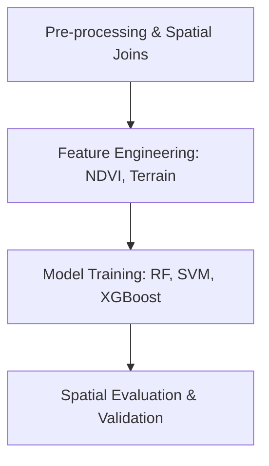

# 🤖 Machine Learning for GIS
Integrating Machine Learning algorithms with spatial data for predictive modeling and classification.

---

## 🛤️ Roadmap Flow

---

## 🛠️ Mandatory Prerequisites
*   **Programming**: [Python Fundamentals](./Python.md) (Pandas, Scikit-learn).
*   **Statistics**: Basic probability and distribution knowledge.

---

## 🏛️ Level 1: Foundations & Classical Models
- [**Machine Learning Python Tutorial**](https://www.youtube.com/watch?v=gmvvaobm7eQ&list=PLeo1K3hjS3uvCeTYTeyfe0-rN5r8zn9rw) - Master the basics of ML with real-world Python examples.

## 🛠️ Level 2: Geospatial Implementation
- _Coming soon! (Links for spatial regression and spatial weights)_

## 🚀 Level 3: Advanced Optimization
- _Coming soon! (Hyperparameter tuning for spatial models)_

---
_Happy Mapping! 🌍✨_
