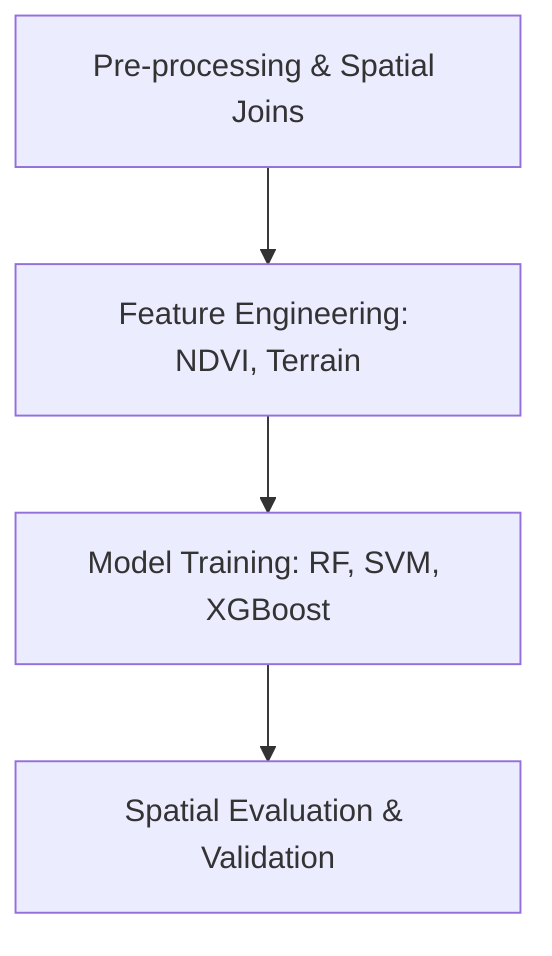

# 🤖 Machine Learning for GIS
Integrating Machine Learning algorithms with spatial data for predictive modeling and classification.

---

## 🛤️ Roadmap Flow

---

## 🛠️ Mandatory Prerequisites
*   **Programming**: [Python Fundamentals](./Python.md) (Pandas, Scikit-learn).
*   **Statistics**: Basic probability and distribution knowledge.
*   [**An Introduction to Earth and Environmental Data Science**](https://earth-env-data-science.github.io/intro.html) - Basics of research computing in Earth science.
*   [**Pythia Foundations**](https://foundations.projectpythia.org/landing-page.html) - A community learning resource for Python-based computing in the geosciences.

---

## 🏛️ Level 1: Foundations & Classical Models
- [**Machine Learning Python Tutorial**](https://www.youtube.com/watch?v=gmvvaobm7eQ&list=PLeo1K3hjS3uvCeTYTeyfe0-rN5r8zn9rw) - Master the basics of ML with real-world Python examples.

## 🛠️ Level 2: Geospatial Implementation
- _Coming soon! (Links for spatial regression and spatial weights)_

## 🚀 Level 3: Advanced Optimization
- _Coming soon! (Hyperparameter tuning for spatial models)_

## 🌍 Level 4: Environmental & Climate Applications
- [**Machine Learning in Weather & Climate**](https://lms.ecmwf.int/course/index.php?categoryid=1) - Massive Open Online Course designed by ECMWF.
- [**Applied Machine Learning Tutorial for Earth Scientists**](https://github.com/eabarnes1010/ml_tutorial_csu) - Short hands-on course designed by the Barnes Research Group.
- [**Machine Learning for Weather and Climate**](https://docs.google.com/document/d/1SPNxZrbHMaIEaS2dbntDow9x_tgSuFTUTOugfa2NuRo/edit) - Short course designed by CIRA for atmospheric science researchers.
- [**Explainable Artificial Intelligence for Environmental Science**](https://docs.google.com/document/d/1lqpABwDl3kPe6ThE-NIDR64PimnltJEuKNkysDZuWKQ/edit) - Short course designed for AI2ES/CIRA researchers.
- [**Artificial Intelligence for Earth Monitoring**](https://www.futurelearn.com/courses/artificial-intelligence-for-earth-monitoring) - Hands-on course from the Copernicus Programme for students.

---
_Happy Mapping! 🌍✨_
