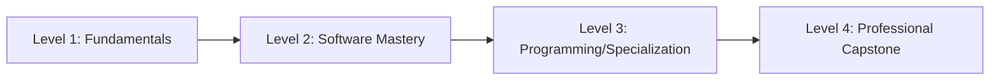

# 🌐 Online Geospatial Courses
A compilation of high-quality external courses and training platforms.

---

## 🛤️ Learning Roadmap

---

## 🏛️ Level 1: Foundations (GIS basics)
- _University Intro courses (links coming soon)_

## 🛠️ Level 2: Software Mastery (ArcGIS/QGIS)
- _Official training paths (links coming soon)_

## 🚀 Level 3: Specialization (ML/Python)
- _Advanced tracks (links coming soon)_

---
🚀 **Knowledge is power. Keep mapping!**
