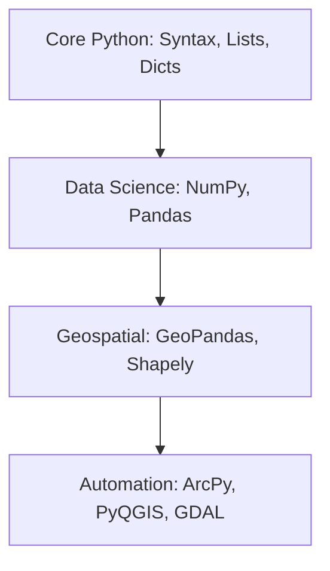

# 🐍 Python for Geospatial
Python is the industry standard for GIS automation and data science.

---

## 🛤️ Roadmap Flow

---

## 🏛️ Level 1: Core Python Fundamentals
_Resources for basic syntax and logic coming soon._

## 📊 Level 2: Data Science with Pandas
_Resources for data manipulation coming soon._

## 🗺️ Level 3: Geospatial Analysis (GeoPandas)
_Resources for spatial operations coming soon._

## ⚙️ Level 4: Industry Automation
_Resources for ArcPy / PyQGIS scripts coming soon._

---
_Happy Mapping! 🌍✨_
