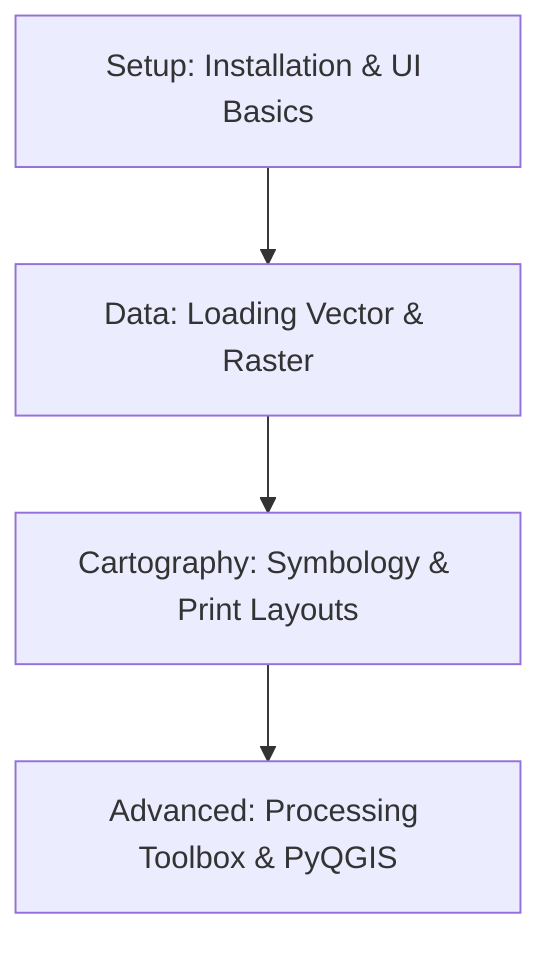

# 🎓 QGIS Resources
QGIS is the leading free and open-source desktop Geographic Information System.

---

## 🛤️ Roadmap Flow

---

## 🏛️ Level 1: Getting Started
- _Installation and Interface guides coming soon._

## 🛠️ Level 2: Core GIS Operations
- _Tutorials for editing, joins, and basic spatial analysis coming soon._

## 🚀 Level 3: Automation & Plugins
- _Information on the Python Console and QGIS Plugins coming soon._

---
_Happy Mapping with Open Source! 🌍✨_
