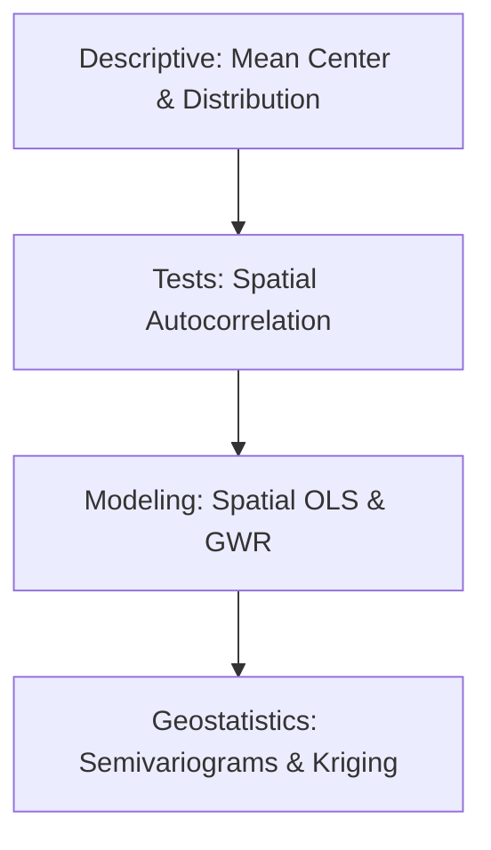

# 📈 Spatial Statistics
Advanced statistical modeling and quantitative analysis of geographic data.

---

## 🛤️ Roadmap Flow

---

## 🛠️ Mandatory Prerequisites
*   **Statistics**: Basic understanding of mean, variance, and hypothesis testing.
*   **Software**: Proficiency in [QGIS](./QGIS.md), [ArcGIS](./ArcGIS.md), or [R/Python](./Python.md).

---

## 🏛️ Level 1: Spatial Pattern Analysis
_Resources for Kernel Density and Distribution coming soon._

## 📊 Level 2: Autocorrelation (Moran's I)
_Tutorials on LISA and spatial clustering coming soon._

## 📐 Level 3: Advanced Regression
_Spatial Lag and Spatial Error models coming soon._

---
_Measure the geography! 🗺️_
